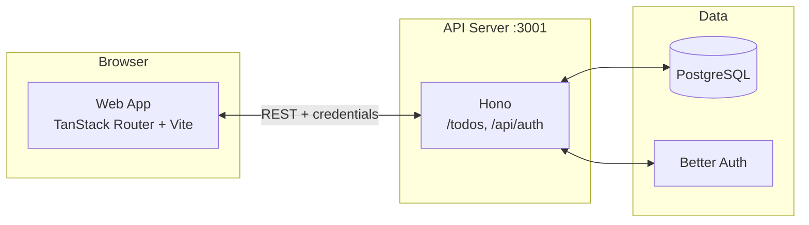

# TODO List Web Application

Bun-powered monorepo with a **web app** (TanStack Router + Vite) and **API** (Hono on Cloudflare Workers). Implements a team-based TODO (issue) system with CRUD, filtering, sorting, and optional real-time features.

## Setup

### Prerequisites

- [Bun](https://bun.sh) (v1.3+)
- Node 20+ (for tooling if needed)
- PostgreSQL (e.g. [Neon](https://neon.tech) or local)

### Environment

1. Copy env example and fill in values:
   ```bash
   cp .env.example .env
   ```
2. Required for API + DB:
   - `DATABASE_URL` — PostgreSQL connection string
   - `BETTER_AUTH_SECRET` — Random secret for sessions
   - `BETTER_AUTH_URL` — Auth base URL (e.g. `http://localhost:3000` for web, or API URL if auth is served from API)
   - `GOOGLE_CLIENT_ID` / `GOOGLE_CLIENT_SECRET` — For Google OAuth
   - `CORS_ORIGINS` — Comma-separated origins (e.g. `http://localhost:3000,http://localhost:5173`)
3. Web app: set `VITE_API_URL` if the API is not at `http://localhost:3001` (e.g. in `apps/web/.env`).

### Install and database

```bash
bun install
bun run db:push
```

### Run

- **All apps:** `bun run dev`
- **API only (port 3001):** `bun run dev:server`
- **Web only (port 3000):** `bun run dev:web`

Open the web app at `http://localhost:3000`. Sign in with Google, pick or create an org/team, then use Board or Team Issues to manage TODOs.

## Usage

- **Board** (`/org/:orgId/team/:teamId/board`): Kanban view; drag issues between Todo / In Progress / Done.
- **Team Issues** (`/org/:orgId/team/:teamId/issues`): Table with create, filter (status, priority, due range), sort (title, status, due date, etc.), and row actions to edit or delete.
- **My Issues** (`/org/:orgId`): Issues assigned to you in that org.

Create TODOs via “New issue”, edit via the row “Edit” action, delete via “Delete” with confirmation.

## TODO List API

Base URL: `http://localhost:3001` (dev). Base path for TODOs: **`/todos`**.  
Full OpenAPI spec: **`http://localhost:3001/doc`**.

| Method | Path | Description |
|--------|------|-------------|
| GET | `/todos/:orgId/issues` | My TODOs in the org (assigned to current user). Query: `status`, `dueBefore`, `dueAfter`, `search`, etc. |
| GET | `/todos/:orgId/team/:teamId/issues` | Team TODOs (paginated). Query: `page`, `perPage`, `sort`, `status`, `dueBefore`, `dueAfter`, `search`, etc. |
| POST | `/todos/:orgId/team/:teamId/issues` | Create a TODO (issue). Body: `title`, `description`, `status`, `priority`, `dueDate`, etc. |
| PATCH | `/todos/:orgId/team/:teamId/issues/:issueId` | Update a TODO. |
| DELETE | `/todos/:orgId/team/:teamId/issues/:issueId` | Delete a TODO. |

**List query params (filter/sort):**

| Param | Description |
|-------|-------------|
| `status` | `todo` \| `in_progress` \| `done` |
| `dueBefore` | ISO8601 datetime; due date ≤ this |
| `dueAfter` | ISO8601 datetime; due date ≥ this |
| `sort` | `title:asc`, `title:desc`, `status:asc`, `status:desc`, `dueDate:asc`, `dueDate:desc`, `createdAt:asc`, `createdAt:desc` |
| `page`, `perPage` | Pagination (team list only). |

All TODO routes require an authenticated session (cookie or credentials).

## Model mapping (TODO ↔ Issue)

In this app, **TODO** and **Issue** are the same concept:

| Spec / UX term | API & DB field | Values |
|----------------|----------------|--------|
| TODO name | `title` | string |
| Description | `description` | string or null |
| Due date | `dueDate` | ISO8601 or null |
| Status | `status` | `todo` \| `in_progress` \| `done` (display: Not Started / In Progress / Completed) |

## Testing

- **Unit / integration (Vitest):**  
  - Web: `cd apps/web && bun run test`  
  - API: `cd apps/api && bun run test` (when added)
- **E2E (Playwright):** `cd apps/web && bun run test:e2e`  
  - For authenticated flows, the API must be running on port 3001 (e.g. `bun run dev:server` in another terminal).  
  - See `AGENTS.md` for test project setup and CI.

## Architecture



- **Web** (port 3000): TanStack Router, React Query, shadcn/ui, Tailwind. Calls API with `credentials: "include"`.
- **API** (port 3001): Hono, OpenAPI, auth middleware. Serves `/todos/*` (TODO CRUD) and `/api/auth/*` (Better Auth). DB via Drizzle + Neon PostgreSQL.

## More

- **AGENTS.md** — Development guide, commands, and conventions.
- **docs/API-DTOs.md** — Request/response models (DTOs) for the TODO API.
- **OpenAPI** — `{API_URL}/doc` for full schema and try-it-out.
